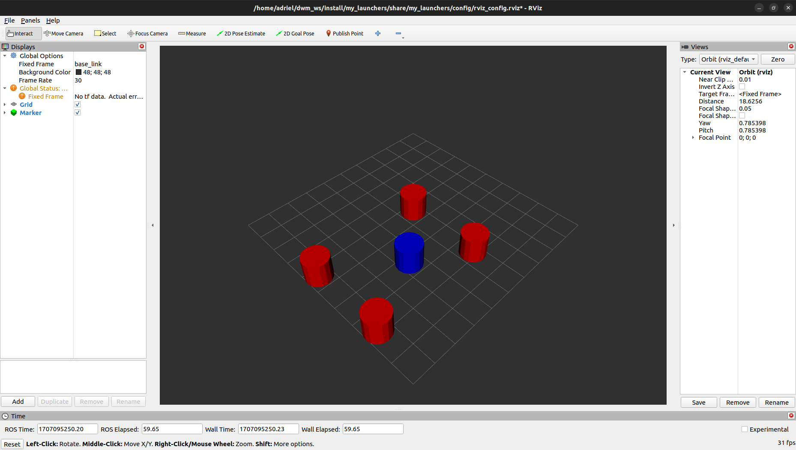

# Simulating Decawave UWB data with ROS2

Simulate, store and view Decawave (now Qorvo) UWB listener data

## Requirements

This program was made with `Python 3.10` and `ROS2 Humble` using `ubuntu 22.03`. click on the following links to check installation steps:

[Python installation](https://www.python.org/downloads/)

[ROS2 humble](https://docs.ros.org/en/humble/Installation.html)

## Installation

After you have installed python and ROS2 humble into your ubuntu system, you can clone this repo:

```bash
git clone https://github.com/Xpect8tions/Decawave-ros-data-sim
```

next, move into the directory to build your workspace:

```bash
cd Decawave-ros-data-sim
colcon build
```

now you should see the `build`, `install` and `log` folders along side the `src` directory. Once all that has been done, you can start testing the code.

## Inside the package

The `/src/locator` package contains 4 main folders, [/locator](./src/locator/locator/), [/launch](./src/locator/launch/), [/config](./src/locator/config/) and [/logging](./src/locator/logging/).

### /locator

The `/locator` folder contains the 2 main files `serial_port_pub.py` and `serial_port_sub.py` to be run or launched.
The `serial_port_pub.py` program simulates the UWB message that is recieved by the computer through the COM port (see figure below) and then published to the `/output` string topic via ros.

")
The `serial_port_sub.py` program will create a subscriber that then subscribes to the `/output` string topic. it then processes the recieved message and stores it in a the csv that is in the `/logging` folder. Once it is done processing the string, it will also publish the information recieved to the `/markers` message so that the information can be viewed with RViz.

### /logging

The `/logging` folder contains a single csv which is updated while the `serial_port_sub.py` file runs.

### /launch

The `/launch` directory contains a launch file, `serial.launch.py` that launches the `serial_port_sub.py` program. It also launches RViz with a preset config which is determined by the [rviz_config.rviz](./src/locator/config/rviz_config.rviz) file in the `/config` folder. [Click here for details.](./src/locator/config/README.md)

When launching this program, RViz will also get launched. The data that the subscriber has processed is then passed on to the RViz publisher to view the location of the tags and anchors.


_The red cylinders are the anchors and the blue cylinder is the tag_

## Running the programs

Both the files mentioned above need to be run simultaneously to be able to see how the program works properly.

open 2 seperate terminals and enter the workspace in both terminals:

```bash
cd Decawave-ros-data-sim
```

remember to source ROS2 and install in all new terminals you may open:

```bash
source /opt/ros/<distro>/setup.bash
source install/setup.bash
```

in one terminal, run:

```bash
ros2 launch locator serial.launch.py
```

in the other terminal, run:

```bash
ros2 run locator serial_pub
```

you should see an RViz window open with 4 red cylinders and 1 blue one. The blue one should be moving toward the bottom corner.


